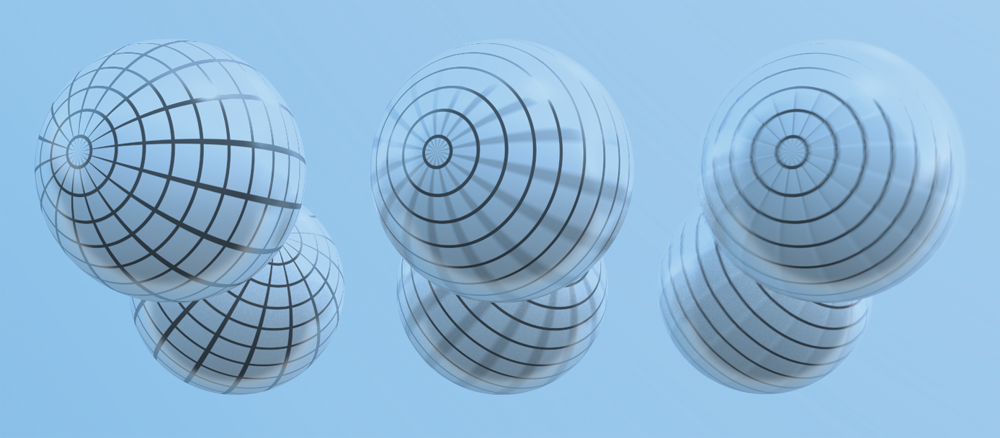

# Geometry and Transformations

## 1.7 Animating Transformations

To simulate the effect of movement in our scenes, we can animate transformations. Figure 1 gives an example of the desired affect:

<p align="center">
    
</p>

*Figure 1: simulating the affect of movement using keyframe transformations*

To achieve this affect, we will allow our renderer to support the specification of *keyframe* transformations, which are associated with a point in time. This makes it possible for the camera to move and for objects in the scene to be moving during the time the simulated camera’s shutter is open. The renderer will achieve this affect by interpolating between the keyframe matrices. 

In order to interpolate between transform matricies, we can use an approach called *matrix decomposition*. Given a transformation matrix \\(M\\), we decompose it into a concatenation of scale (\\(S\\)), rotation (\\(R\\)) and translation (\\(T\\)) transformations:

\\[
            M = SRT
\\]

While interpolation between translation and scale matricies can be performed easily using linear interpolation, interpolating rotations is more difficult. To understand them, we will first dive into an alternative method of representing rotations: quaternions. Using quaternions provides an effective method of interpolating between rotations.


## 1.7.1 Quaternions

Quaternions are a four-dimensional number system. Just as the complex numbers can be considered to be a two-dimensional extension of the real numbers, quaternions are a four-dimensional extension of the complex numbers. Their properties make them particularly convenient for representing rotation in three dimensions.

### Complex numbers and 2d rotation

To understand quaternions as a means of representing 3D rotation, it's useful to consider how the complex numbers can represent rotation in 2d space. A complex number consists of two values: a 'real' part, and an 'imaginary' part, where the imaginary part is some coefficient of the constant \\(i = \sqrt{-1}\\).  Here are some examples:

\\[
        3 + 5i \\\\
        1 + 2i \\\\
        6 + 4i \\\\
\\]

To multiply two complex numbers, we multiply each term in the first number by each term in the second number. In places where we encounter \\(i^2\\), we can substitute with -1, as we know that \\(i = \sqrt{-1}\\). For example:

\\[
        (1 + 4i)(5 + i)\\\\
        = (1)(5) + (1)(i) + (4i)(5) + (4i)(i)\\\\
        = 5 + i + 20i + 4i^2\\\\
        = 5 + 21i + 4i^2\\\\
        = 5 + 21i + 4(-1)\\\\
        = 5 + 21i - 4\\\\
        = 1 + 21i\\\\
\\]

We can imagine the complex numbers as existing on a 2D plane, where the real component represents the \(x\) axis, ad the \(y\) component represents the imaginary axis. 


<p align="center">
    
</p>

*Figure 2: Complex numbers represented in a 2D plane.*

This means that we can think of complex numbers as 2D vectors -- for example, the complex number \\(2 + 4i\\) above is the same as the 2D vector \\((2, 4)\\). This relationship has some useful properties. For example, we can rotate a vector by an angle \\(\theta\\) by converting it to a complex number and multiplying it by another complex number \\(c = \cos(\theta) + i \sin(\theta)\\). We can also multiply one vector by another to rotate the first vector by the angle of the second.

For example, in Figure 3, we have three vectors: red: \\((1, 1)\\), green: \\((0, 1)\\), and blue: \\((-1, 1)\\). 

<p align="center">
    
</p>

*Figure 3: Three two-dimensional unit vectors, where the blue vector has an angle equal to the sum of the angles of the red and green vectors*

The red vector has an angle of \\(45^\circ\\), and the green vector has an angle of \\(90^\circ\\). We can convert them to complex numbers and multiply them as follows:

\\[
        (red)(green) = \\\\
        (1 + 1i)(0 + 1i) = \\\\
        (1)(0) + 1i + (1i)(0) + (1i)(1i) = \\\\
        1i + 1i^2 = \\\\
        1i + -1 = \\\\
        -1 + 1i = \\\\
        (-1, 1)
\\]

The result \\(-1, 1\\) is equal to the blue vector in Figure 3, which has an angle of \\(135^\circ\\). Multiplying the complex numbers also results in the scaling of the magnitudes (not shown in this example, as we dealt with unit vectors). It turns out that the algebraic properties of complex numbers all have intuitive geometric interpretations -- multiplication applies scaling and rotation as demonstrated here; dividing has the opposite affect, and addition and subtraction work in the same way as vector addition and subtraction.

One might think that, to extend this pattern into three dimensions, we could come up with a new kind of complex number with two imaginary parts \\(i\\) and \\(j\\), where both \\(i\\) and \\(j\\) = \\(\sqrt{-1}\\). However, it turns out that this kind of 'triple' does not have the properties we need from a number system. For example, there is no way of defining multiplication and division on these triples such that division is the inverse of multiplication. However, it **is** possible to create a number system with the desired properties by extending the complex numbers into four dimensions.

### Quaternions

Quaternions are four-dimensional numbers with the following form:

\\[
    q = (x, y, z, w) \\\\
    = w + xi + yj + zk
\\]

\\(i\\), \\(j\\) and \\(k\\) are defined such that \\(i^2 = j^2 = k^2 = ijk = -1\\). We can also represent quaternions as \\((q_{xyz}, q_w)\\), where \\(q_{xyz}\\) is the imaginary 3-vector and \\(q_w\\) is the real part.
Multiplication of two quaternions can be expressed in terms of the dot and cross products:


\\[
   (qq')_{xyz} = q\_{xyz} \times q\_{xyz} + q_wq'\_{xyz} + q'\_wq\_{xyz} \\\\
   (qq')_q = q_wq'_w - (q\_{xyz} \cdot q'\_{xyz})
\\]

For the unit quaternions (that is, quaternions where the sum of squared components is 1), a 3D rotation of \\(2\theta\\) can be mapped to a quaternion \\((\hat{v}, sin(\theta), cos(\theta)\\)). We can then apply this to a point \\(p\\) represented in homogeneous coordinates with the following equation:

\\[
     p' = qpq^{-1}
\\]

To implement quaternions in rust, we can represent the imaginary part of the quaternion as a vector, and the real part as a scalar as follows:

```rust
struct Quaternion<T> {
    v: Vector3d,
    w: T
}
```
Arithmetic methods are implemented in a similar fashion to the `Vector*`, `Point*` and `Normal3d` types, in call cases simply using element-wise operations:

```rust
impl<T:Scalar> Add for Quaternion<T> {
    type Output = Quaternion<T>;
    fn add(self, other: Quaternion<T>) -> Quaternion<T> {
        Quaternion {
            v: self.v + other.v,
            w: self.w + other.w,
        }
    }
}
impl<T: Scalar> Sub for Quaternion<T> {
    type Output = Quaternion<T>;
    fn sub(self, other: Quaternion<T>) -> Quaternion<T> {
        Quaternion {
            v: self.v - other.v,
            w: self.w - other.w,
        }
    }
}
impl<T: Scalar> Mul<T> for Quaternion<T> {
    type Output = Quaternion<T>;
    fn mul(self, other: T) -> Quaternion<T> {
        Quaternion {
            v: self.v * other,
            w: self.w * other,
        }
    }
}
impl<T: Scalar> Div<T> for Quaternion<T> {
    type Output = Quaternion<T>;
    fn div(self, other: T) -> Quaternion<T> {
        Quaternion {
            v: self.v / other,
            w: self.w / other,
        }
    }
}
```
We additionally provide a `dot()` method for the inner product, and a `normalize()` method:

```rust
impl<T: Scalar + Float > Quaternion<T> {
    pub fn new(v: Vector3d<T>, w: T) -> Self {
        Quaternion{v, w}
    }
    pub fn dot(&self, other: &Self) -> T {
        self.v.dot(&other.v) + self.w * other.w
    }
    pub fn normalize(&self) -> Self {
        let norm = Scalar::sqrt(self.dot(&self));
        Quaternion{v: self.v / norm, w: self.w / norm}
    }
    ...
}
```
It is additionally useful to be able to convert a quaternion to and from a transformation matrix. The equation \\(p' = qpq^{-1}\\) for the quaternion product can be expanded to produce the following matrix which represents the same transformation:

\\[
    R(Q) = 
    \begin{bmatrix}
    2(q_0^2 + q_1^2) - 1 & 2(q_1q_2 - q_0q_3) & 2(q_1q_3 - q_0q_2)  \\\\
    2(q_1q_2 - q_0q_3) & 2(q_0^2 + q_2^2) & 2(q_2q_3 - q_0q_1)  \\\\
    2(q_1q_3 - q_0q_2) & 2(q_2q_3 - q_0q_1) & 2(q_0^2 + q_2^3) \\\\
    \end{bmatrix}
\\]

This conversion and the conversion from matrix to quaternion are implemented in the `from_transform()` and `to_transform()` methods respectively.

## Quaternion interpolation

The `slerp()` method interpolates between two quaternions using **spherical linear interpolation**. We can imagine this method as finding intermediate vectors along the surface of a sphere. This method has two desirable properties:

- **Torque minimization**, which means that it finds the shortest possible path between two rotations.
- **Constant angular velocity**, which means the relationship bewteen the interpolation parameter \\(t\\) and the change in rotation is constant.

Figure 4 visualizes the spherical linear interpolation problem. Our aim is to find an intermediate rotation \\(q(t\\) from \\(q_0\\) and \\(q_1\\) given the interpolation term \\(t\\). To simplify our understanding, we can imagine the rotation as taking place on a single 'slice' of the sphere, a unit circle.

<p align="center">
    
</p>

To solve the problem, we find a quaternion orthogonal to \\(q_0\\),  \\(q_\bot\\). Then we just need to find the base and height of the triangle formed between \\(q_1\\) and \\(q_0\\) -- this is given by \\(q(t) = q_0 \cos\theta' + q_1 \sin\theta'\\).

To find \\(q_\bot\\), we project \\(q_1\\) on to \\(q_0\\) then subtract the orthogonal projection from q1. This is exactly the same pattern we used in the transformations section, when rotating a vector around an arbitrary axis:

\\[
   q_{\bot} = q_1 - (q_1 \cdot q_0) q_0
\\]

Intermediate quaternions can now be found with:

\\[
    q(t) = q_0 \cos(\theta t) + \hat{q_{\bot}} \sin(\theta t)
\\]

Following the c++ `pbrt` implementation, the Slerp() function checks to see if the two quaternions are nearly parallel, in which case it uses regular linear interpolation of quaternion components in order to avoid numerical instability. Otherwise, it computes an orthogonal quaternion `qperp` and interpolation using the equations above.

```rust
impl<T: Scalar + Float > Quaternion<T> {
    ...
    pub fn slerp(&self, other: &Self, t: T) -> Self {
        let cos_theta = self.dot(other);
        if cos_theta  > T::one() - Scalar::epsilon() {
            return (*self * (T::one() - t) + *other * t).normalize();
        } else {
            let theta = clamp(cos_theta, -T::one(), T::one()).acos();
            let theta_p = theta * t;
            let qperp = (*other - *self * cos_theta).normalize();
            return *self * theta_p.cos() + qperp * theta_p.sin();
        }
    }
```

### AnimatedTransform Implementation

Keyframe animation is implemented using the `AnimatedTransform` class. 