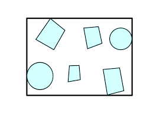

# Geometry and Transformations

## 1.5 Bounding Boxes

A bounding box describes the extent of some region of space. Bounding boxes will be useful for our renderer, because if we divide a space into bounding boxes we can make early decisions about whether calculations need to be done in a particular area (so if you imagine we have 10 complex objects in a box, we can first check if a calculation need sto be done for the box at all, and avoid it if not).

<p align="center">
    
</p>

*Fig 1.1: A bounding box around a set of objects in two dimensions*

We can represent a bounding box in terms of it's min and max bounds, which are points in space. Here are what the structs look like:

```rust
pub struct Bounds2d<T> {
    pub min: Point2d<T>,
    pub max: Point2d<T>,
}
pub struct Bounds3d<T> {
    pub min: Point3d<T>,
    pub max: Point3d<T>,
}
```

The `impl` blocks for the `Bounds` structs provide a constructor which automatically selects the min and max points from the two arguments, as well as a default method that setting the extent to an invalid configuration, which violates the invariant that pMin.x <= pMax.x. This allows operations involving empty boxes e.g., Union() to return the correct result (otherwise they would contain everything and always be true). I've also included a `new_from_point` method for returning a box from a single point.

```rust
impl<T: Scalar> Bounds3d<T> {
    pub fn new(p1: Point3d<T>, p2: Point3d<T>) -> Self {
        let min = Point3d::<T>::new(
            p1.x.min(p2.x),
            p1.y.min(p2.y),
            p1.z.min(p2.z)
        );
        let max = Point3d::<T>::new(
            p1.x.max(p2.x),
            p1.y.max(p2.y),
            p1.z.max(p2.z)
        );
        Bounds3d {
            min,
            max
        }
    }
    pub fn new_from_point(p: Point3d<T>) -> Self {
        Bounds3d {
            min: p,
            max: p
        }
    }
    pub fn default() -> Self {
        Bounds3d {
            min: Point3d{x: T::inf(), y: T::inf(), z: T::inf()},
            max: Point3d{x: -T::inf(), y: -T::inf(), z: -T::inf()}
        }
    }
}
```
The c++ pbrt implementation also has an overloaded 'Union' method for adding both points and other boxes to boxes. We can achieve this in rust with traits as follows:

```rust
trait Union<T> {
    fn union(&self, other: &T) -> Self;
}
impl<T: Scalar> Union<Point2d<T>> for Bounds2d<T> {
    fn union(&self, other: &Point2d<T>) -> Self {
        Bounds2d {
            min: Point2d {
                x: self.min.x.min(other.x),
                y: self.min.y.min(other.y)
            },
            max: Point2d {
                x: self.max.x.max(other.x),
                y: self.max.y.max(other.y)
            }
        }
    }
}
impl<T: Scalar> Union<Bounds2d<T>> for Bounds2d<T> {
    fn union(&self, other: &Bounds2d<T>) -> Self {
        Bounds2d {
            min: Point2d {
                x: self.min.x.min(other.min.x),
                y: self.min.y.min(other.min.y)
            },
            max: Point2d {
                x: self.max.x.max(other.max.x),
                y: self.max.y.max(other.max.y)
            }
        }
    }
}
```

This lets us call `union()` with either a `Point` or another `Bounds`, and have the compiler choose the correct method.

