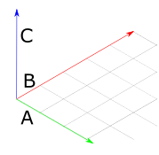

# Geometry and Transformations

## 1.3 Normals

A normal vector is a vector which is perpendicular to a surface at particular point. To calculate it, we take the cross product of any two nonparallel vectors which are tangent to the surface at a point.

For example, in the diagram below, C is a normal vector of the plane formed by A and B:

<p align="center">
    
</p>

Normals look a lot like vectors, but behave differently, particularly when it comes to transformations. My Rust implementation of pbrt will follow the original implementation in defining them as a separate type, `Normal3d`.
`Normal3d` includes all of the functionality of `Vector3d`, with the exception of the cross product. 

The c++ pbrt implementation also includes a method called `FaceForward`, which flips a surface normal so that it lies in the same hemisphere as a given vector. This is implemented for all four combinations of Normals and Vectors, and provides an opportunity to further experiment with Rust generics. Here's the `FaceForward` trait:

```rust
/// Flip a surface normal so that it lies in the same hemisphere as a given vector.
/// This is useful for computing the reflection direction.
/// This trait provides default behavior for any combination of vector types.
pub trait FaceForward<T: Dot<T, U> + Clone + Neg<Output = T>, U: Scalar>: Dot<T, U> {
    fn face_forward(&self, other: T) -> T {
        if self.dot(&other) < zero() {
            other.clone()
        } else {
            -other.clone()
        }
    }
}
/// Implements the FaceForward trait for any combination of vector types.
impl<U: Scalar, T: Dot<T, U> + Clone + Neg<Output = T>, V: Dot<T, U>> FaceForward<T, U> for V{}
```

This trait provides default behaviour for any type which can perform a dot() operation with some other type, where that type can be cloned and negated.