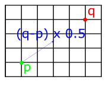

# Geometry and Transformations

## 1.2 Points

A point is a location in 2d or 3d space. 
We can represent points in terms of their co-ordinates -- so \\(x,y\\) for 2d and \\(x,y,z\\) for 3d points.
Although this is the same basic representation as vectors, the fact that they represent positions instead of directions means that they will be treated differently. The Rust structs for points look similar to vectors:

```rust
pub struct Point2D<T> {
    pub x: T,
    pub y: T,
}
impl<T: Scalar> Point2D<T> {
    pub fn new(x: T, y: T) -> Self {
        Point2D{x, y}
    }
}
pub struct Point3D<T> {
    pub x: T,
    pub y: T,
    pub z: T,
}
impl<T: Scalar> Point3D<T> {
    pub fn new(x: T, y: T, z: T) -> Self {
        Point3D{x, y, z}
    }
}
```
The C++ pbrt implementation also includes methods for:
- Converting a 3d point to 2d by dropping the 'z' component.
- Converting points of one type (e.g. floats) to another (e.g. int)
- Converting a point of one type to a vector of another type.

To achieve this in Rust, we can add appropriate methods to the `Point` implementations.
To do the type conversions, we need to add additional type parameters. Taking the conversion of `Point3d` betweent types as an example:

```rust
impl<T: Scalar> Point3d<T> {
    ...
    pub fn from<U, V: From<U>>(p: Point3d<U>) -> Point3d<V> {
        Point3d{x: p.x.into(), y: p.y.into(), z: p.z.into()}
    }
}
```
The `from<U, V>` statement declares two generic types, then `(p: Point3d<U>) -> Point3d<V>` specifies that we will take an argument of one type and convert to the other. The trait bound on `V`, `V: From<U>` means that we will only support types which support this conversion. Types that satisfy this trait will have an `into()` method which will do the cast for us.

## Operations on vectors and points

We can add or subtract vectors and points by applying the addition/subtraction operation componentwise. Adding and subtracting vectors and points has the affect of offsetting the point along the vector. So if we think of a vector as a path, if we start at point A and add the vector, we end up at point B. Subtraction has the opposite affect -- if we start at point A and subtract the vector, we walk in the opposite direction of its trajectory.

<p align="center">
    
    
</p>

*Fig 1: Geometrical interpretation of vector-point addition (left) and vector-point subtraction (right).*

To implement these in Rust, we can follow the same pattern as for vectors -- importing the `std::ops::Add` and `std::ops::Sub` traits and providing implementations.

```rust
impl<T: Scalar> Add<Vector3d<T>> for Point3d<T> {
    type Output = Self;
    fn add(self, other: Vector3d<T>) -> Self {
        Point3d{x: self.x + other.x, y: self.y + other.y, z: self.z + other.z}
    }
}
impl<T: Scalar> Sub<Vector3d<T>> for Point3d<T> {
    type Output = Self;
    fn sub(self, other: Vector3d<T>) -> Self {
        Point3d{x: self.x - other.x, y: self.y - other.y, z: self.z - other.z}
    }
}
```

Subtracting two points gives us the vector between them, as shown below:

<p align="center">
    
</p>

This means that we can easily find the distance between two points by subtracting them and taking the length of the resulting vector. We can implement this by using the `length()` method added to the `Vector` structs in the previous chapter. First we implement `Sub` for points, which returns a vector:

```rust
impl<T: Scalar> Sub<Point3d<T>> for Point3d<T> {
    type Output = Vector3d<T>;
    fn sub(self, other: Self) -> Self::Output {
        Vector3d{x: self.x - other.x, y: self.y - other.y, z: self.z - other.z}
    }
}
```
Then we add the `distance` method to the `impl` block for the `Point` structs. I've also added `distance_squared` following the c++ pbrt implementation:

```rust 
impl<T: Scalar> Point3d<T> {
    ...
    pub fn distance(self, other: Self) -> T {
        return (self - other).length();
    }
    pub fn distance_squared(self, other: Self) -> T {
        return (self - other).squared_length();
    }
}
```
Following the pbrt book, we also include methods for adding points and scalar multiplication with a point, which are similar to the implementation for `Vector`.

## Linear interpolation

It's often necessary to interpolate between two points. For example, given the two points \\((x_0, y_0)\\) and \\((x_1, y_1)\\) in the image below, we may want to find some intermediate point \\((x, y)\\).

<p align="center">
    
</p>

*Fig 2: Linear interpolation*

The goal of interpolation is to be able to return arbitrary points which lie between two values. So we are aiming for a method with the following signature:

```rust
impl<T: Scalar> Point2d<T> {
    ...
    pub fn lerp(&self, t: T, p0: Point2d<T>, p1: Point2d<T>) -> Point2d<T>;
}
```
We want this method to return a point at p0 when the *t* argument is 0, and a point at p1 when the value of t is 1.
We can interpolate between two points by imagining a straight line between them, as in the above diagram, then picking points along it. We can get a line like this by finding the vector between the two points (using subtraction, as implemented earlier), then multiplying the resulting vector by some amount. For example, if we scale it by 0.5, we get a vector pointing in the same direction, but with half the length. We then just need to add the starting point (if we just took the x and y values of the vector, our line would start from the origin).

<p align="center">
    
        
            
                
</p>

*Fig 3: Linear interpolation by finding the vector between two points then scaling it.*

The above process can be translated into code as follows:

```rust
impl<T: Scalar> Point2d<T> {
    ...
        pub fn lerp(self, other: Self, t: T) -> Self {
        return self + (other - self) * t;
    }
}
```

## Miscellaneous point operations

The c++ implementation of pbrt includes:
- operations for returning component-wise min and max
- operations for applying floor(), ceil(), and abs() to each component and returning a new point
- a permute operation which returns a new point with components permuted based on some indices

These are mostly straightfoward, although it should be noted that floor() and ceil() are only defined for floating-point types, so we need to define these in a separate `impl` block which specifies the `Float` trait bound:

```rust
impl<T: Scalar + Float> Point3d<T> {
    pub fn floor(self) -> Self {
        Point3d::new(self.x.floor(), self.y.floor(), self.z.floor())
    }
    pub fn ceil(self) -> Self {
        Point3d::new(self.x.ceil(), self.y.ceil(), self.z.ceil())
    }
}
```

