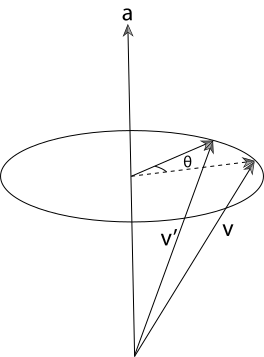
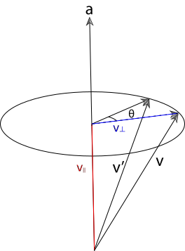
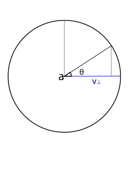
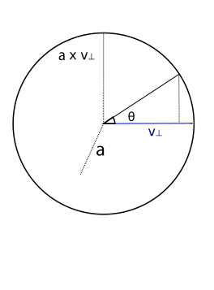
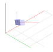

# Geometry and Transformations

## 1.6 Transformations

A transformation is a mapping from points to points or from vectors to vectors. In 3D graphics, we are most interested in translations (moving from position to position), scaling, and rotation around an axis.

It turns out that we can express these translations in 4x4 matrices, which, when multiplied with a vector or point, will result a new vector/point with the translation applied. 
The same set of matrices will work for both vectors and points To do this, we first convert our representation of vectors and points into a single, 4 element representation: their **homogeneous coordinates**. The additional component will be zero for a vector, and a non-zero value for points. So both points and vectors will look like this:

\\[
    p = (x, y, z, 1) \\\\
    v = (x, y, z, 0)
\\]

This representation is very convenient, because it means that the operations we might perform on points and vectors will reflect their geometric interpretation. For example, if we subtract two points, we get a vector:

\\[
    (8, 4, 2. 1) - (3, 2, 1, 1) = (5, 2, 1, 0)
\\]

And adding two vectors gives us another vector:

\\[
    (0, 0, 1, 0) - (1, 0, 0, 0) = (1, 0, 1, 0)
\\]

Once we have 4-element tuples like those above, we can construct 4x4 matrices which, when multipled with a point or vector, result in the desired transformation. 

### Scaling

If we want to scale each element of a point or vector, we can construct a matrix like this:

\\[
    \begin{bmatrix}
    5 & 0 & 0 & 0\\\\
    0 & 5 & 0 & 0\\\\
    0 & 0 & 5 & 0\\\\
    0 & 0 & 0 & 1
    \end{bmatrix}
\\]

Multiplying this with a vector or point will result in the \\(x, y, z\\) values of the point being multiplied by 5, with the \\(w\\) value preserved (so scaling a point returns a point, and scaling a vector returns a vector). This is shown below. To multiply a 4-vector and a matrix, we take its dot product with each row in the matrix.

\\[
\begin{bmatrix}
5 & 5 & 5 & 1
\end{bmatrix} 
    \begin{bmatrix}
    5 & 0 & 0 & 0\\\\
    0 & 5 & 0 & 0\\\\
    0 & 0 & 5 & 0\\\\
    0 & 0 & 0 & 1
    \end{bmatrix}=
\begin{bmatrix}
25 & 25 & 25 & 1
\end{bmatrix}
\\]

### Translation 

For translation, we just want to add some scalar value to each element. To do that, we can construct a matrix like this one:

\\[
    \begin{bmatrix}
    1 & 0 & 0 & T_x\\\\
    0 & 1 & 0 & T_y\\\\
    0 & 0 & 1 & T_z\\\\
    0 & 0 & 0 & 1
    \end{bmatrix}
\\]

To understand this, we can imagine a point \\((3, 3, 3, 1\\)) which we want to translate by \\(1, 0, 0\\). We can just focus on the \\(x\\) axis as this is the only one we expect to change. We take our input vector and take its dot product with the row vector \\((1, 0, 0, 1\\)):

\\[
        (3, 3, 3, 1) \cdot (1, 0, 0, 1)\\\\
        = 3 \times 1 + 3 \times 0 + 3 \times 0 + 1 \times 1 \\\\
        = 3 + 1
\\]

So -- the '1' in the first entry of row 1 means we start with the original value of x, then all others are set to zero except for the final value, which will get multipied by 1. To take the dot product, we sum those values, which gives us the expected result of 3 + 1 for x. The translation happens because we multiply the final value of the row by the point's \\(w\\) value of 1. This has the consequence that translation has no impact on a vector, which makes sense, as vectors have no position.

## Rotation

To understand how to construct rotation matrices, it's useful to first understand the notion of **basis vectors**. The basis vectors are a set of unit vectors which lie along the axes of a co-ordinate system.

<p align="center">
    
</p>

*Figure 1: The basis vectors \\(\hat{i}\\), \\(\hat{j}\\) and \\(\hat{k}\\), which are unit vectors parallel to the \\(x\\), \\(y\\) and \\(z\\) axes.*

\\(\hat{i}\\) typically describes the unit vector in \\(x\\); \\(\hat{j}\\) typically describes the unit vector in \\(y\\); and \\(\hat{k}\\) typically describes the unit vector in \\(z\\). So the basis vectors are:

\\[
    \hat{i} = 
    \begin{bmatrix}
    1 \\\\ 0 \\\\ 0 \\\\
    \end{bmatrix}
    \quad
    \hat{j} = 
    \begin{bmatrix}
    0 \\\\ 1 \\\\ 0 \\\\
    \end{bmatrix}
    \quad
    \hat{k} = 
    \begin{bmatrix}
    0 \\\\ 0 \\\\ 1 \\\\
    \end{bmatrix}
\\]

We can think of all vectors in a given co-ordinate system as being composed of these basis vectors. For example, if we imagine this vector:

\\[
    v = 
    \begin{bmatrix}
    2 \\\\ 3 \\\\ 4
    \end{bmatrix}
\\]

We can also imagine this as being composed of the basis vectors:

\\[
    v = 2\hat{i} + 3\hat{j} + 4 \hat{k}
    = 2
    \begin{bmatrix}
    1 \\\\ 0 \\\\ 0
    \end{bmatrix}
    + 3
    \begin{bmatrix}
    0 \\\\ 1 \\\\ 0
    \end{bmatrix}
    + 4
    \begin{bmatrix}
    0 \\\\ 0 \\\\ 1
    \end{bmatrix}
    = 
    \begin{bmatrix}
    2 \\\\ 3 \\\\ 4
    \end{bmatrix}
\\]

This means that if we can figure out how to transform the basis vectors, we can transform anything in their space. Let's think about how we might rotate the 2d basis vectors. Figure 2 shows our goal -- we want to take the vectors \\(\hat{i}\\) (in red) and \\(\hat{j}\\) (blue) and rotate them by the angle \\(\theta\\).

<p align="center">
    
</p>

*Figure 2: Rotating a vector in two dimensions.*


To do this, we can imagine the two right-angled triangles formed by each basis vector and the target (rotated) vectors:

<p align="center">
    
</p>

*Figure 3: Using triangles to calculate the x and y values of rotated basis vectors.*

To find the \\(x\\) and \\(y\\) components of the new vectors, we just need to find the length of the base (adjacent side) and height (opposite side) of each of these triangles.

The formulas for sine and cosine allow us to retrieve these values for the angle \\(\theta\\):

\\[
    cos(\theta) = \frac{adjacent}{hypotenuse}\\\\
    sin(\theta) = \frac{opposite}{hypotenuse}
\\]

Because we are dealing with the basis vectors, which have a length of one, we can remove the division term, giving us:

\\[
    cos(\theta) = adjacent\\\\
    sin(\theta) = opposite
\\]

So for the red basis vector (\\(\hat{i}\\)), the rotated version is given by:

\\[
    i_x = cos(\theta)\\\\
    i_y = sin(\theta)\\\\
\\]

For the blue basis vector, the same pattern applies, but because the base of the triangle is along the y-axis, the values correspond to different sides of the triangle: we get \\(j_x\\) from the length of the opposite side, and \\(j_y\\) from the length of the adjacent side. We also need to negate the x component, as it extends to the left of the x-axis:

\\[
    j_x = -sin(\theta)\\\\
    j_y = cos(\theta)\\\\
\\]

Now we know how to calculate the new x and y values for the basis vectors, we can construct a 2x2 matrix to transform them by a given angle:

\\[
    \begin{bmatrix}
    \cos \theta & -\sin \theta \\\\
    \cos \theta & \sin \theta \\\\
    \end{bmatrix}
\\]

To verify that this matrix works, we can multiply it with the basis vectors \\(\hat{i} = (1, 0)\\) and \\(\hat{j} = (0, 1)\\) used in the previous examples:

\\[
    R(\hat{i}) = \\\\
    \begin{bmatrix}
    \cos \theta & -\sin \theta \\\\
    \cos \theta & \sin \theta \\\\
    \end{bmatrix}
    \begin{bmatrix}
    1 \\\\ 0
    \end{bmatrix}\\\\
    =
    \begin{bmatrix}
    (1 \times \cos \theta) - (0 \times \sin \theta) \\\\ 
    (1 \times \sin \theta) + (0 \times \cos \theta) 
    \end{bmatrix}\\\\
    =
    \begin{bmatrix}
    \cos \theta\\\\ 
    \sin \theta\\\\
    \end{bmatrix}
\\]

\\[
    R(\hat{j}) = \\\\
    \begin{bmatrix}
    \cos \theta & -\sin \theta \\\\
    \cos \theta & \sin \theta \\\\
    \end{bmatrix}
    \begin{bmatrix}
    0 \\\\ 1
    \end{bmatrix}\\\\
    =
    \begin{bmatrix}
    (0 \times \cos \theta) - (1 \times \sin \theta) \\\\ 
    (0 \times \sin \theta) + (1 \times \cos \theta) 
    \end{bmatrix}\\\\
    =
    \begin{bmatrix}
    - \sin \theta\\\\ 
    \cos \theta\\\\
    \end{bmatrix}
\\]

To take this into three dimensions, we just need to add an extra dimension, and make it so that one dimension remains unchanged while we rotate the vector around the target axis. So we are looking for three matrices, one per rotation axis, which will leave that component of the vector unchanged whilst modifying the others to reflect the rotation.

\\[
    M_x = 
    \begin{bmatrix}
    ? & ? & ? \\\\
    ? & ? & ? \\\\
    ? & ? & ? \\\\
    \end{bmatrix}
    \quad
    M_y = 
    \begin{bmatrix}
    ? & ? & ? \\\\
    ? & ? & ? \\\\
    ? & ? & ? \\\\
    \end{bmatrix}
    \quad
    M_z = 
    \begin{bmatrix}
    ? & ? & ? \\\\
    ? & ? & ? \\\\
    ? & ? & ? \\\\
    \end{bmatrix}
\\]

It's useful to start with the z-axis, because we've actually already covered the meat of it! A 2d rotation can also be imagined as a 3d rotation around the z-axis -- nothing moves in z, and we modify x and y to reflect the rotation. So all we need to do is take the 2d matrix used in the 2d example, move it into 3 dimensions, then ensure that the z axis stays constant. To fix the z axis, we can set the third column of the matrix to the basis vector \\(\hat{k}\\) = (\\(0, 0, 1)\\), and set the \\(z\\) value of the first and second columns (which represent the \\(\hat{i}\\) and \\(\hat{j}\\) basis vectors) to 0.

\\[
    M_z = 
    \begin{bmatrix}
    \cos \theta & -\sin \theta & 0 \\\\
    \sin \theta & \cos \theta & 0 \\\\
    0 & 0 & 1 \\\\
    \end{bmatrix}
\\]

To derive the remaining matrices, we can go back to our original interpretation of rotation as finding the sides of triangles. However, this time we will fix x (which we can imagine projects out of the screen toward us), and manipulate the y and z axes.

<p align="center">
    
</p>

*Figure 4: Rotating a vector around the \\(x\\) axis. We imagine \\(x\\) as extending out of the screen, and set the remaning axes to y (horizontal) and z (vertical).*

The red triangle now represents the calculation for basis vector \\(\hat{j}\\), and the blue triangle now represents the calculation for \\(\hat{k}\\). To find the y-component of the transformed vector \\(j_y\\), we need the length of the base of the red triangle, which is \\(\cos (\theta)\\). 
To find \\(j_z\\), we need the length of the opposite side of the blue triangle, which is \\(\sin (\theta)\\). 

For \\(k\\), we get the y-component from the inverse of the length of the opposite side of the blue triangle, so \\(-\sin \theta\\). The z-component comes from the length of the base of the blue triangle, which is \\(\cos \theta\\). So we have the following:

\\[
    j_y = \cos(\theta)\\\\
    j_z = \sin(\theta)\\\\
    k_y = -\sin(\theta)\\\\
    k_z = \cos(\theta)
\\]

To create a matrix from these, we first want to ensure that the \\(\hat{i}\\) basis vector remains constant. To do this, we set the first column to that basis vector:

\\[
   M_x = 
    \begin{bmatrix}
    1 & ? & ? \\\\
    0 & ? & ? \\\\
    0 & ? & ? \\\\
    \end{bmatrix}
\\]

We also want to ensure that the x-components of the y and z vectors are unaffected by the rotation, so we put zeros in their x-components:

\\[
   M_x = 
    \begin{bmatrix}
    1 & 0 & 0 \\\\
    0 & ? & ? \\\\
    0 & ? & ? \\\\
    \end{bmatrix}
\\]

The middle column of this matrix represents \\(\hat{j}\\), and the third column represents \\(\hat{k}\\):

\\[
   M_x = 
    \begin{bmatrix}
    1 & 0 & 0 \\\\
    0 & \hat{j}_y & \hat{k}_y \\\\
    0 & \hat{j}_z & \hat{k}_z \\\\
    \end{bmatrix}
\\]

So we can fill in the values we determined above using the triangle method:

\\[
   M_x = 
    \begin{bmatrix}
    1 & 0 & 0 \\\\
    0 & \cos(\theta) & -\sin(\theta) \\\\
    0 & \sin(\theta) & \cos(\theta) \\\\
    \end{bmatrix}
\\]

To rotate around the Y-axis, we can just do the same trick again: take the triangle analogy above, then imagine that the Y axis is extending out from the screen, with X mapped to the vertical axis and Z mapped to the horizontal axis. We then get:

\\[
    k_x = \sin(\theta)\\\\
    k_z = \cos(\theta)\\\\
    i_x = \cos(\theta)\\\\
    i_z = -\sin(\theta)
\\]

Once again, we want to ensure the rotation axis stays constant, so the middle column of our matrix needs to be set to \\(\hat{j}\\):

\\[
   M_x = 
    \begin{bmatrix}
    ? & 0 & ? \\\\
    ? & 1 & ? \\\\
    ? & 0 & ? \\\\
    \end{bmatrix}
\\]

We then set the \\(y\\) value of the other basis vectors to zero:

\\[
   M_x = 
    \begin{bmatrix}
    ? & 0 & ? \\\\
    0 & 1 & 0 \\\\
    ? & 0 & ? \\\\
    \end{bmatrix}
\\]

The first column of this matrix represents \\(\hat{i}\\), and the final column represets \\(\hat{k}\\). 

\\[
   M_x = 
    \begin{bmatrix}
    i_x & 0 & k_x \\\\
    0 & 1 & 0 \\\\
    i_z & 0 & k_z \\\\
    \end{bmatrix}
\\]

So we can fill in the values from the triangle method:

\\[
   M_x = 
    \begin{bmatrix}
    \cos(\theta) & 0 & \sin(\theta) \\\\
    0 & 1 & 0 \\\\
    -\sin(\theta) & 0 & \cos(\theta) \\\\
    \end{bmatrix}
\\]

Finally, to make these transformations compatible with the 4x4 transforms introduced earlier in the section, we need to add padding. This padding will be all zeros, except for the bottom right-hand element of the matrix, which ensures that the w-component of the input is preserved, so a rotated vector is a vector, and a rotated point is a new point. This gives us the following matrices:


\\[
    R_x(\theta) =
    \begin{bmatrix}
    1 & 0 & 0 & 0\\\\
    0 & cos \theta & - sin \theta & 0\\\\
    0 & -sin \theta & cos \theta & 0\\\\
    0 & 0 & 0 & 1
    \end{bmatrix}
\\]

\\[
    R_y(\theta) =
    \begin{bmatrix}
    cos \theta & 0 &- sin \theta & 0\\\\
    0 & 1 & 0 & 0\\\\
    sin \theta & 0 & cos \theta & 0\\\\
    0 & 0 & 0 & 1
    \end{bmatrix}
\\]

\\[
    R_z(\theta) =
    \begin{bmatrix}
    cos \theta & - sin \theta & 0 & 0\\\\
    sin \theta & cos \theta & 0 & 0\\\\
    0 & 0 & 1 & 0\\\\
    0 & 0 & 0 & 1
    \end{bmatrix}
\\]

## Rotating around an arbitrary axis

So far we have covered the rotation matrices for the \\(x\\), \\(y\\) and \\(z\\) axes. What if we want to rotate around an arbitrary vector?


<p align="center">
    
</p>

*Figure 5: Rotating a vector around an arbitrary axis*

Figure 5 visualizes the the problem -- we want to take the unit vector \\(v\\) and move it around the axis \\(a\\) by \\(\theta^{\circ}\\).

To simplify this problem, we can imagine \\(v\\) as being composed of two vectors: \\(v_{\parallel}\\), which is parallel to \\(a\\), and \\(v_{\bot}\\), which is perpendicular to \\(a\\). This is shown in Figure 6.

<p align="center">
    
</p>

*Figure 6: The vector \\(v\\) can be decomposed into \\(v_{\parallel}\\), which is parallel to \\(a\\), and \\(v_{\bot}\\), which is perpendicular to \\(a\\).*

We can find \\(v_{\parallel}\\) by projecting \\(v\\) on to \\(a\\). The standard formula for a projection is:

\\[
    \frac{a \cdot b}{|a|^2}a
\\]

Because \\(a\\) is a unit vector, this simplifies to:

\\[
   v_{\parallel} = (v \cdot a)a
\\]

\\(v_{\bot}\\) can then be found by subtracting \\(v_{\parallel}\\) from \\(v\\):


\\[
   v_{\bot} = v - (v \cdot a) a
\\]


Because \\(v = v_{\bot} + v_{\parallel}\\), to get the rotated vector \\(v'\\), we can find the sum of the rotation of \\(v_{\parallel}\\) and \\(v_{\bot}\\). We already know that the rotation of \\(v_{\parallel}\\) will be \\(v_{\parallel}\\), because it is parallel to the axis of rotation \\(a\\). To find \\(v_{\bot}\\), we can re-orient our view such that we are looking straight down \\(a\\). This reduces the problem to a rotation in 2D:

<p align="center">
    
</p>

*Figure 7: The rotation of \\(v_{\bot}\\) can be viewed as a rotation in 2d*

The base of this triangle gives us the x-component of \\(v_{\bot}\\), and the opposite side gives us the y-component. The base is equal to \\(\cos \theta\\), and the opposite is equal to \\(\sin \theta\\). We will need to multiply these by some new basis vectors in order to translate them into our initial frame. The horizontal axis in Figure 7 is easy to find: it's \\(v_{\bot}\\). If we imagine the view rotated slightly such that we can see \\(a\\) (Figure 8), it becomes clear that the vertical axis is one perpendicular to both \\(v_{\parallel}\\) and \\(a\\), which means we can obtain it from their cross product \\(v_{\parallel} \times a\\).

<p align="center">
    
</p>

*Figure 8: The vertical axis when rotating \\(v_{\bot}\\) is the cross-product of \\(v_{\bot}\\) and \\(a\\)*

Summarizing the derivation, we can decompose \\(v\\) into \\(v_{\parallel}\\) and \\(v_{\bot}\\) as follows:

\\[
    v_{\parallel} = (v \cdot a)a \\\\
    v_{\bot} = v - (v \cdot a) a
\\]

This allows us to express the rotation as:

\\[
    R(v) = R(v_{\parallel}) + R(v_{\bot}) \\\\
\\]

No rotation is required for \\(v_{\parallel}\\) because it is parallel to the axis of rotation. The calculation of \\(R(v_{\bot})\\) can be thought of as a two-dimensional rotation, with each component multipled by a new basis vector to orient the circle of rotation correctly. The horizontal basis is \\(v_{\bot}\\), and the vertical basis is \\(v_{\parallel} \times a\\). This gives us:

\\[
    R(v) = v_{\parallel} + v_{\bot}\cos \theta + (v_{\parallel} \times a) \sin \theta
\\]

## The Look-At Transformation

Given a point representing the location of a camera, a point the camera is looking at, and an 'up' vector which orients the camera along the vector described by the first two parameters, the look-at transformation maps from a left-handed co-ordinate system to one with the camera at the origin, looking along the z-axis, with the y-axis pointing upward. In other words, it lets us describe a camera position and orientation in "world-space" and provides a means of mapping between that space and the camera's viewpoint. The look-at transformation tells us what things look like from the camera's perspective.

To construct this transformation, we can use the same principles applied for the other transformations -- we create a matrix where each column describes the effect of the transformation on the basis vectors of a co-ordinate system.


The fourth column of the matrix gives the origin, and since our camera will be at the origin, we set this to the position of the camera in world space.

\\[
    position = (x, y, z, 1)\\\\
    lookAt = (x, y, z, 1)\\\\
    up = (x, y, z, 0)\\\\
    \begin{bmatrix}
    ? & ? & ? & position_x\\\\
    ? & ? & ? & position_y\\\\
    ? & ? & ? & position_z\\\\
    ? & ? & ? & 1\\\\
    \end{bmatrix}
\\]

To get \\(z\\), we compute the normalized vector between the camera's position and the look-at point


\\[
    position = (x, y, z, 1)\\\\
    lookAt = (x, y, z, 1)\\\\
    up = (x, y, z, 0)\\\\
    direction = \hat{(lookAt - position)}\\\\
    \begin{bmatrix}
    ? & ? & direction_x & position_x\\\\
    ? & ? & direction_y & position_y\\\\
    ? & ? & direction_z & position_z\\\\
    ? & ? & 0 & 1\\\\
    \end{bmatrix}
\\]

For \\(x\\), we take the cross-product of the 'up' bector with the direction vector, as we know this axis should be orthogonal to 'up' and the direction:

\\[
    position = (x, y, z, 1)\\\\
    lookAt = (x, y, z, 1)\\\\
    up = (x, y, z, 0)\\\\
    direction = \hat{(lookAt - position)}\\\\
    right = up \times direction\\\\
    \begin{bmatrix}
    ? & right_x & direction_x & position_x\\\\
    ? & right_y & direction_y & position_y\\\\
    ? & right_z & direction_z & position_z\\\\
    ? & 0 & 0 & 1\\\\
    \end{bmatrix}
\\]

Finally, \\(y\\) is recomputed by taking the cross product of the viewing direction vector with the transformed \\(x\\)-axis vector:

\\[
    position = (x, y, z, 1)\\\\
    lookAt = (x, y, z, 1)\\\\
    up = (x, y, z, 0)\\\\
    direction = \hat{(lookAt - position)}\\\\
    right = \hat{up} \times direction\\\\
    newUp = direction \times right\\\\
    \begin{bmatrix}
    newUp_x & right_x & direction_x & position_x\\\\
    newUp_y & right_y & direction_y & position_y\\\\
    newUp_z & right_z & direction_z & position_z\\\\
    0 & 0 & 0 & 1\\\\
    \end{bmatrix}
\\]

<p align="center">
    
</p>

*Figure 9: The look-at transform maps between the co-ordinate system of the world and the co-ordinate system of the camera*

## Implementing the transformations

To implement the transformations, we first create a struct for representing 4x4 Matrices, with some basic operations for construction, a multiplication operator, and transposition:

```rust
struct Matrix4x4<T> {
    data: [[T;4]; 4]
}
impl<T: Scalar> Matrix4x4<T> {
    pub fn new(data: [[T;4]; 4]) -> Self {
        return Matrix4x4 {
            data
        }
    }
    pub fn from_values(t00: T, t01: T, t02: T, t03: T,
        t10: T, t11: T, t12: T, t13: T,
        t20: T, t21: T, t22: T, t23: T,
        t30: T, t31: T, t32: T, t33: T) -> Self {
            Matrix4x4{
                data: [
                    [t00, t01, t02, t03],
                    [t10, t11, t12, t13],
                    [t20, t21, t22, t23],
                    [t30, t31, t32, t33]
                ]
            }
        }
    pub fn transpose(&self) -> Self {
        return Matrix4x4::from_values(
            self.data[0][0], self.data[1][0], self.data[2][0], self.data[3][0],
            self.data[0][1], self.data[1][1], self.data[2][1], self.data[3][1],
            self.data[0][2], self.data[1][2], self.data[2][2], self.data[3][2],
            self.data[0][3], self.data[1][3], self.data[2][3], self.data[3][3]);
    }
}
impl<T: Scalar> Index<usize> for Matrix4x4<T> {
    type Output = [T;4];
    fn index(&self, x: usize) -> &[T; 4] {
        return &self.data[x];
    }
}
impl<T: Scalar> Mul for Matrix4x4<T> {
    type Output = Matrix4x4<T>;
    fn mul(self, other: Matrix4x4<T>) -> Matrix4x4<T> {
        let mut data: [[T;4];4] = [[T::zero();4];4];
        for i in 0..4{
            for j in 0..4{
                data[i][j] = self[i][0] * other[0][j] + 
                        self[i][1] * other[1][j] + 
                        self[i][2] * other[2][j] + 
                        self[i][3] * other[3][j];
            }
        }
        return Matrix4x4{
            data
        }
    }
}
impl<T: Scalar> Mul<T> for Matrix4x4<T> {
    type Output = Matrix4x4<T>;
    fn mul(self, scalar: T) -> Matrix4x4<T> {
        let mut data: [[T;4];4] = [[T::zero();4];4];
        for i in 0..4{
            for j in 0..4{
                data[i][j] = self.data[i][j] * scalar;
            }
        }
        return Matrix4x4{
            data
        }
    }
}
```
We can then implement a `Transform` struct which will implement our transformations. The struct has members storing the underling matrix, as well as its inverse, which will be stored by the `Transform` to avoid having to re-calculate the inverse on demand.

```rust
pub struct Transform {
    m: Matrix4x4
    m_inv: Matrix4x4
}
```
There are several constructors for the `Transform`. The `default` constructor creates a transform with its matrix set to the identity matrix; the `new` constructor creates a transform based on a given matrix and its inverse. The remaining methodsr return transform matrices as described in the previous section:

```rust 
impl<T: Scalar + Float> Transform<T> {
    pub fn default() -> Self {
        return Transform { 
            m: Matrix4x4::from_values(
                T::one(), T::zero(), T::zero(), T::zero(),
                T::zero(), T::one(), T::zero(), T::zero(),
                T::zero(), T::zero(), T::one(), T::zero(),
                T::zero(), T::zero(), T::zero(), T::one()
            ), 
            m_inv: Matrix4x4::from_values(
                T::one(), T::zero(), T::zero(), T::zero(),
                T::zero(), T::one(), T::zero(), T::zero(),
                T::zero(), T::zero(), T::one(), T::zero(),
                T::zero(), T::zero(), T::zero(), T::one()
            )}
    }
    pub fn new(m: Matrix4x4<T>, m_inv: Matrix4x4<T>) -> Self {
        return Transform { m, m_inv }
    }
    pub fn inverse(&self) -> Self {
        return Transform { m: self.m_inv, m_inv: self.m };
    }
    pub fn transpose(&self) -> Self {
        return Transform { m:self.m.transpose(), m_inv: self.m_inv.transpose() }
    }
    pub fn is_identity(&self) -> bool {
        let identity = Matrix4x4::from_values(
            T::one(), T::zero(), T::zero(), T::zero(),
            T::zero(), T::one(), T::zero(), T::zero(),
            T::zero(), T::zero(), T::one(), T::zero(),
            T::zero(), T::zero(), T::zero(), T::one()
        );
        return self.m.eq(&identity);
    }
    pub fn translate(delta: Vector3d<T>) -> Transform<T> {
        let m = Matrix4x4::from_values(
            T::one(), T::zero(), T::zero(), delta.x,
             T::zero(), T::one(), T::zero(), delta.y,
              T::zero(), T::zero(), T::one(), delta.z,
               T::zero(), T::zero(), T::zero(),T::one());
        let m_inv = Matrix4x4::from_values(
            T::one(), T::zero(), T::zero(), -delta.x,
            T::zero(), T::one(), T::zero(), -delta.y,
             T::zero(), T::zero(), T::one(), -delta.z,
              T::zero(),T::zero(), T::zero(), T::one());
        return Transform{m, m_inv};
    }
    pub fn scale(x:T, y:T, z:T) -> Transform<T> {
        let m = Matrix4x4::from_values(            
        x, T::zero(), T::zero(), T::zero(),
        T::zero(), y, T::zero(), T::zero(),
        T::zero(), T::zero(), z, T::zero(),
        T::zero(), T::zero(), T::zero(), T::one());
        let m_inv = Matrix4x4::from_values(            
            T::one()/x, T::zero(), T::zero(), T::zero(),
            T::zero(), T::one()/y, T::zero(), T::zero(),
            T::zero(), T::zero(), T::one()/z, T::zero(),
            T::zero(), T::zero(), T::zero(), T::one());
        return Transform{m, m_inv};
    }
    pub fn has_scale(&self) -> bool {
        return true;
    }
    pub fn rotate_z(angle: T) -> Self {
        let (mut sin, mut cos) = angle.sin_cos();
        sin = sin.to_radians();
        cos = cos.to_radians();
        let m = Matrix4x4::from_values(
            cos, -sin, T::zero(), T::zero(),
            sin, cos, T::zero(), T::zero(),
            T::zero(), T::zero(), T::one(), T::zero(),
            T::zero(), T::zero(), T::zero(), T::one()
        );
        return Transform { 
            m, 
            m_inv: m.transpose()}
    }
    pub fn rotate_y(angle: T) -> Self {
        let (mut sin, mut cos) = angle.sin_cos();
        sin = sin.to_radians();
        cos = cos.to_radians();
        let m = Matrix4x4::from_values(
            cos, T::zero(), sin, T::zero(),
            T::zero(), T::one(), T::zero(), T::zero(),
            -sin, T::zero(), cos, T::zero(),
            T::zero(), T::zero(), T::zero(), T::one()
        );
        return Transform { 
            m, 
            m_inv: m.transpose()}
    }
    pub fn rotate_x(angle: T) -> Self {
        let (mut sin, mut cos) = angle.sin_cos();
        sin = sin.to_radians();
        cos = cos.to_radians();
        let m = Matrix4x4::from_values(
            T::one(), T::zero(), T::zero(), T::zero(),
            T::zero(), cos, -sin, T::zero(),
            T::zero(), sin, cos, T::zero(),
            T::zero(), T::zero(), T::zero(), T::one()
        );
        return Transform { 
            m, 
            m_inv: m.transpose()}
    }
    pub fn rotate(angle: T, axis: Vector3d<T>) -> Transform<T> {
        let a = axis.normalized();
        let (mut sin, mut cos) = angle.sin_cos();
        sin = sin.to_radians();
        cos = cos.to_radians();
        let mut m = Matrix4x4::default();
        // Compute rotation of first basis vector
        m.data[0][0] = a.x * a.x + (T::one() - a.x * a.x) * cos;
        m.data[0][1] = a.x * a.y * (T::one() - cos) - a.z * sin;
        m.data[0][2] = a.x * a.z * (T::one() - cos) + a.y * sin;
        m.data[0][3] = T::zero();
        // Compute rotations of second and third basis vectors
        m.data[1][0] = a.x * a.y * (T::one() - cos) + a.z * sin;
        m.data[1][1] = a.y * a.y + (T::one() - a.y * a.y) * cos;
        m.data[1][2] = a.y * a.z * (T::one() - cos) - a.x * sin;
        m.data[1][3] = T::zero();
        
        m.data[2][0] = a.x * a.z * (T::one() - cos) - a.y * sin;
        m.data[2][1] = a.y * a.z * (T::one() - cos) + a.x * sin;
        m.data[2][2] = a.z * a.z + (T::one() - a.z * a.z) * cos;
        m.data[2][3] = T::zero();
        return Transform{m, m_inv: m.transpose()};
    }
    pub fn look_at(pos: Point3d<T>, target: Point3d<T>, up: Vector3d<T>) -> Self {
        let dir = (target - pos).normalized();
        let right = up.cross(&dir).normalized();
        let new_up = dir.cross(&right);
        let m = Matrix4x4::from_values(
            right.x, new_up.x, dir.x, pos.x,
            right.y, new_up.y, dir.y, pos.y,
            right.z, new_up.z, dir.z, pos.z,
            T::zero(), T::zero(), T::zero(), T::one()
        );
        return Transform{m, m_inv: m.inverse()};
    }
```