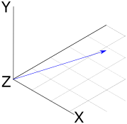
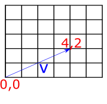
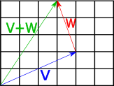
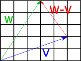
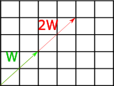
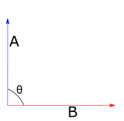
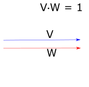
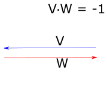
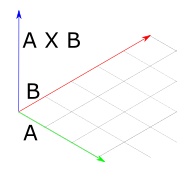

# Vectors

1.1 Vectors

A vector is a quantity with a magnitude and a direction. We can imagine a vector as a pointed arrow, where the direction of the arrow signals the direction of the vector, and the length of the arrow represents magnitude.

<p align="center">
    
</p>

*Fig 1: A visual representation of a three-dimensional vector.*

Vectors will give our renderer the mathematical foundation for modeling rays of light. Our renderer will represent vectors in terms of their co-ordinates from the origin. For example, the two-dimensional vector \\(V=(1,1)\\)
can be visualized as a line starting at the origin (0,0) and extending to the point (4,2).

<p align="center">
    
</p>

*Fig 2: A visual representation of the vector (4,2).*


To represent vectors in our Rust renderer, we will use two structs: `Vector2d` for the two-dimensional case, and `Vector3d` for the three-dimensional case. Because we may want to create vectors of both floating-point and integer types in our rendering application, it's useful to implement these as generic types, as follows:

```rust
pub struct Vector2d<T> {
    pub x: T,
    pub y: T
}
impl<T> Vector2d<T> {
    fn new(x: T, y: T) -> Self {
        Vector2d { x, y }
    }
}

pub struct Vector3d<T> {
   pub x: T,
   pub y: T,
   pub z: T
}
impl<T> Vector3d<T> {
    pub fn new(x: T, y: T, z: T) -> Self {
        Vector3d { x, y, z }
    }
}
```

For the remainder of these examples, I'll focus on the implementations for the `Vector3d` class, which are essentially the same as for `Vector2d`.

The components of vectors can be accessed as simple properties on the struct (`vec.x`, `vec.y` etc.). For some algorithms, it is also useful to be able to iterate over the components of vectors, so in addition to allowing access by property, we overload the index operator to allow `vec[0]`, `vec[1]` etc. To overload operators in Rust, we import the relevant trait from std::ops and provide an impl statement, as below:

```rust
use std::ops::Index;

impl<T> Index<usize> for Vector3d<T> {
    type Output = T;
    fn index(&self, index: usize) -> &Self::Output {
        match index {
            0 => &self.x,
            1 => &self.y,
            2 => &self.z,
            _ => panic!("Index out of bounds")
        }
    }
}
```

### Adding and subtracting vectors

To add two vectors we just add up the components item-by-by item. So if we have two three-dimensional vectors \\(V\\) and \\(W\\), their sum is a new vector where each component is the sum of the corresponding components of V and W:

\\[
V=(1,3,5) \\\\
W=(2,4,6)  \\\\
V+W=(Vx+Wx,Vy+Wy,Vz+Wz) \\\\
=(1+2,3+4,5+6) \\\\
=(3,7,11) \\\\
\\]

The geometric interpretation of vector addition is equivalent to imagining the two vectors arranged to form a path, where the first vector starts at the origin, and the second vector starts where the first terminates. If we follow the second vector to its terminus, we find outselves at the co-ordinates representing the components of the new vector. The diagram below shows this for two vectors \\(V=(4,2)\\) and \\(W=(−1,3)\\), giving the expected result of \\(V+W=(3,5)\\)

<p align="center">
    
</p>

*Fig 3: Geometric interpretation of vector addition.*

As one might expect, subtraction is also applied elementwise:

\\[
V=(1,3,5) \\\\
W=(2,4,6) \\\\
V−W=(V_x−W_x,V_y−W_y,V_z−W_z) \\\\
=(1−2,3−4,5−6) \\\\
=(−1,−2,−1) \\\\
\\]
The geometric interpretation of vector subtraction is equivalent to imagining both vectors as paths originating at the origin, and finding the vector which connects the second operand to the first operand. The diagram below shows this for two vectors \\(V=(5,2)\\)
and \\(W=(3,5)\\). Subtracting V from W gives us \\(W−V=(−2,3)\\).

<p align="center">
    
</p>

*Fig 4: Geometric interpretation of vector subtraction.*

To implement these operations in Rust, we import the `std::ops::Add` and `std::ops::Sub` traits and provide implementations with `impl` statements. Things get a little tricky here, because the implementations will need to use the + and - operator on the vector components; however, because we are using generics, we are unable to guarantee that the components (which could be of any type) actually support these operators. To get around this, we can use the `num::Real` trait as a trait bound on our implementations, meaning that the `Vector` structs can only be created with numeric types which represent real numbers.

```rust
use num::Real;

impl<T:Real> Vector3d<T> {
    fn new(x: T, y: T, z: T) -> Self {
        Vector3d { x, y, z }
    }
}
```

The `impl<T:Real` statement means that we are implementing the new constructor only for types which represent real numbers. With this in place, we can import the `Add` and `Sub` traits from the `std::ops` crate, and define our addition and subtraction operations:

```rust
use std::ops::{Index, Add, Sub};

impl <T:Real> Add for Vector3d<T> {
    type Output = Vector3d<T>;
    fn add(self, other: Self) -> Self::Output {
        Vector3d::new(self.x + other.x, self.y + other.y, self.z + other.z)
    }
}
impl <T:Real> Sub for Vector3d<T> {
    type Output = Vector3d<T>;
    fn sub(self, other: Self) -> Self::Output {
        Vector3d::new(self.x - other.x, self.y - other.y, self.z - other.z)
    }
}
```

### Vector negation

Negating a vector can be achieved by negating each component. It results in a vector of the same magnitude pointing in the opposite direction. We can implement this in a similar manner to the other operations -- importing the `Neg` trait from `std::ops` and providing an implementation.

```rust
impl <T:Real> Neg for Vector3d<T> {
    type Output = Vector3d<T>;
    fn neg(self) -> Self::Output {
        Vector3d::new(-self.x, -self.y, -self.z)
    }
}
```

### Scalar multiplication and division

A vector can be multiplied and divided by a scalar value. To implement this, we just apply the multiplication/division operation element-wise to the vector.

So scalar multiplication will look like this:

\\[
V=(1,3,5) \\\\
n=10 \\\\
Vn=(V_x+n,V_y+n,V_z+n) \\\\
=(1x10,3x10,5x10) \\\\
=(10,30,50) \\\\
\\]
...and scalar division will look like this:

\\[
V=(1,3,5) \\\\
n=2 \\\\
Vn=(V_xn,V_yn,V_zn) \\\\
=(12,32,52) \\\\
=(0.5,1.5,2.5) \\\\
\\]

The geometric interpretation of these operations that they scale the vector's magnitude by the scalar degree. So the vector \\(V=(2,2)\\)
(of length two) multipled by 2 will become \\((4,4)\\), which is of length 4; dividing this by 2 returns the original value of \\(V\\)

<p align="center">
    
</p>


*Fig 5: Geometric interpretation of multiplying a vector by a scalar.*

In Rust code, this is pretty much the same as what we did for the `Add` and `Sub` operations -- we again import the relevant traits from the `std::ops` library, and provide implementations.

```rust
use std::ops::{Index, Add, Sub, Mul, Div};

impl <T:Real> Mul for Vector3d<T> {
    type Output = Vector3d<T>;
    fn mul(self, other: Self) -> Self::Output {
        Vector3d::new(self.x * other.x, self.y * other.y, self.z * other.z)
    }
}
impl <T:Real> Div for Vector3d<T> {
    type Output = Vector3d<T>;
    fn div(self, other: Self) -> Self::Output {
        Vector3d::new(self.x / other.x, self.y / other.y, self.z / other.z)
    }
}
```

## The dot product of two vectors

The dot product gives us a measure of the similarity between two vectors. This will be useful for doing things like calculating the angle at which light strikes a surface. To take the dot product of two vectors, we multiply their components element-wise, and sum the result:

\\[
V \cdot W = \sum_{i=1}^n V_iW_i\\\\
\\]

For example, the dot product of \\(V = (2, 3, 4\\) and \\(W = (4, 3, 2)\\) is:

\\[
(V_xW_x, V_yW_y, V_zW_z)\\\\
= (2 x 4, 3 x 3, 4 x 2)\\\\
= (8, 9, 8)
\\]

The dot product is useful because of its relationship to the angle between the two vectors -- it is equal to the product of the lengths of the vectors times the cosine of the angle between them:

\\[
V \cdot W = \|V\| \|W\| cos \theta
\\]

A consequence of this is that if both vectors are normalized to have a length of one (see: 'Vector Normalization' below), the magnitudes can be disregarded by removing the first term from the above equation, so we have:

\\[
\hat{V} \cdot \hat{W} = cos \theta
\\]

So the dot product allows us to directly calculate the cosine of the angle between two vectors. When the dot product is 0, this means that the two vectors are exactly perpendicular; when it is 1, it means that the two vectors are parallel, and when it is -1, the vectors point in the opposite directions.


<p align="center">
    
    
    
</p>


*Fig 6: Geometric interpretation of the dot product for unit vectors.*

To implement the dot product in our Rust renderer, we add a `dot()` method to the `impl` block for our `Vector` structs:

```rust
impl<T:Real Vector3d<T> {
    pub fn new(x: T, y: T, z: T) -> Self {
        Vector3d { x, y, z }
    }
    pub fn dot(&self, other: &Self) -> T {
        self.x * other.x + self.y * other.y + self.z * other.z
    }
}
```
## The cross product of two vectors

The cross product of two three-dimensional vectors allows us to find a vector which is orthogonal to both of them. It can be calculated as follows:

\\[
    (V \times W)_x = V_yW_z - V_zW_y\\\\
    (V \times W)_y = V_zW_x - V_xW_z\\\\
    (V \times W)_z = V_xW_y - V_yW_x\\\\
\\]

One way to remember this pattern is to observe that for each component of the output vector (x, y, z), the calculation uses the next two components in the sequence. So for \\((V \times W)_x\\), we use the y and z components of the two input vectors; \\((V \times W)_y\\) uses z and x, and \\((V \times W)_z\\) uses x and y. The calculation then proceeds as follows. For each output component:  
- Identify the two target components for this output component. So for \\((V \times W)_x\\), we are dealing with y and z.  
- Take the first component (from the target components) on the first input vector, and multiply it with the second component on the second input vector. Our target components are y and z, and our input vectors are \\(V\\) and \\(W\\) -- so we multiply \\(V_y\\) and \\(W_z\\)
- Take the second component (from the target components) on the first input vector, and multiply it with the first component on the second input vector. Our target components are y and z, and our input vectors are \\(V\\) and \\(W\\) -- so we multiply \\(V_z\\) and \\(W_y\\)
- Subtract the second multiplication result from the first.

The geometric interpretation of the cross product is that, given two input vectors, it returns a third vector which is orthogonal to the two input vectors. In the image below, vectors \\(A\\) and \\(B\\) form a plane in the X-Z dimension, so their cross-product is a vector which points straight up along the Y axis. The angle between this vector and each of the others is 90 degrees.

<p align="center">
    
</p>

*Fig 7: Geometric interpretation of the cross product.

To implement the cross product for our `Vector3d` struct, we add it to the relevant `impl` block. Note that we don't need to do this for `Vector2d`, as the cross-product is not well-defined for 2d vectors.

```rust
impl<T:Real> Vector3d<T> {
    pub fn new(x: T, y: T, z: T) -> Self {
        Vector3d { x, y, z }
    }
    pub fn dot(&self, other: &Self) -> T {
        self.x * other.x + self.y * other.y + self.z * other.z
    }
    pub fn cross(&self, other: &Self) -> Self {
        Vector3d::new(self.y * other.z - self.z * other.y,
                      self.z * other.x - self.x * other.z,
                      self.x * other.y - self.y * other.x)
    }
}
```

To test this method, we can consider the case of our typical representation of a 3D space with axes, where each axis is a unit vector extending in one dimension only. So we have an X axis \\((1, 0, 0)\\), Y axis \\((0, 1, 0)\\), and Z axis \\((0, 0, 1)\\). We can retrieve the third axis given two others using the cross product:

```rust
#[test]
fn test_vector_3d_cross() {
    let v1 = Vector3d::new(1.0, 0.0, 0.0);
    let v2 = Vector3d::new(0.0, 1.0, 0.0);
    let v3 = Vector3d::new(0.0, 0.0, 1.0);
    assert_eq!(v1.cross(&v2), v3);
    assert_eq!(v3.cross(&v1), v2);
    assert_eq!(v2.cross(&v3), v1);
}
```
However, it should be noted that order matters when calculating the cross product. This because there are always two orthogonal vectors given two inputs -- one in each direction. So if we take the cross products in the above test and reverse the operands, we get the inverse result:

```rust
#[test]
fn test_vector_3d_cross_negative() {
    let v1 = Vector3d::new(1.0, 0.0, 0.0);
    let v2 = Vector3d::new(0.0, 1.0, 0.0);
    let v3 = Vector3d::new(0.0, 0.0, 1.0);
    assert_eq!(v2.cross(&v1), -v3);
    assert_eq!(v1.cross(&v3), -v2);
    assert_eq!(v3.cross(&v2), -v1);
}
```

## Normalization

To normalize a vector we compute a new vector with the same direction but with length one. To achieve this, we first need a way to compute the length of a vector. This can be achieved by taking the square-root of the sum of squared components. So if \\(V\\) is a vector with \\(n\\) components, and lower-case \\(v_n\\) represents each component, the length is calculated as:

\\[
    \|V\| = \sqrt{v_1^2 + v_2^2 ... v_n^2 }\\\\
\\]

To get the normalized vector, we divide it by the length, which is achieved by applying the division to each component:

\\[
    \hat{V} = \frac{V}{\|V\|}\\\\
    = (\frac{V_x}{\|V\|}, \frac{V_y}{\|V\|}, \frac{V_z}{\|V\|})\\\\
\\]

In our Rust code, we can achieve this with a few additional methods for our `Vector` implementations -- `squared_length()`, `length()` and `normalized()`:

```rust
impl<T:Real> Vector3d<T> {
    ...
    pub fn squared_length(&self) -> T {
        self.x * self.x + self.y * self.y + self.z * self.z
    }
    pub fn length(&self) -> T {
        self.squared_length().sqrt()
    }
    pub fn normalized(&self) -> Self {
        Vector3d {
            x: self.x / self.length(),
            y: self.y / self.length(),
            z: self.z / self.length()
        }
    }
```

## Miscellaneous Operations

There are several other methods included for Vectors in the C++ pbrt implementation. These include;
- Methods for retrieving the max and min component of a vector (`min_component()` and `max_component()`)
- A method for retrieving the index of the component with the largest value (`max_dimension()`)
- Component-wise minimum and maximum operations (`min()` and `max()`)
- A method for permuting a vector based on input indices (`permute()`)

## Generating a coordinate system from an input vector

We will frequently want to construct a local coordinate system given only a single 3D vector. 
Because the cross product of two vectors is orthogonal to both, we can apply the cross product two times to get a set of three orthogonal vectors for the coordinate system. The corresponding method on our Rust implemention of `Vector3d` looks like this:

```rust
impl<T:Real> Vector3d<T> {
    ...
    pub fn coordinate_system(&self) -> (Self, Self) {
        let y = if self.x.abs() > self.y.abs() {
            Vector3d::new(-self.z, zero(), self.x) / 
            (self.x * self.x + self.z * self.z).sqrt()
        } else {
            Vector3d::new(zero(), self.z, -self.y) / 
            (self.y * self.y + self.z * self.z).sqrt()
        };
        (self.cross(&y), y)
    }
}
```

One thing of note here is the `zero()` function imported from `num` -- this allows us to provide a 0 value as default without specifying a type. If we used `0.0` here, the Rust compiler would complain, as this would commit us to a vector of floats, but we have defined `Vector` as a generic type.

In a similar manner to the tests for the cross product, we can test this method by passing it a unit vector in X (\\(1, 0, 0)\\) -- we expect it to return corresponding orthogonal vectors in Y and Z. We can further convince ourselves that these are orthogonal using the dot product, as we expect a value of zero for the dot product of two orthogonal vectors.

```rust
#[test]
fn test_vector_3d_coordinate_system() {
    let v = Vector3d::new(1.0, 0.0, 0.0).normalized();
    let (v1, v2) = v.coordinate_system();
    assert_eq!(v1, Vector3d::new(0.0, -1.0, 0.0));
    assert_eq!(v2, Vector3d::new(0.0, 0.0, 1.0));
    assert_eq!(v1.dot(&v2), 0.0);
    assert_eq!(v2.dot(&v1), 0.0);
    assert_eq!(v.dot(&v1), 0.0);
    assert_eq!(v.dot(&v2), 0.0);
}
```
